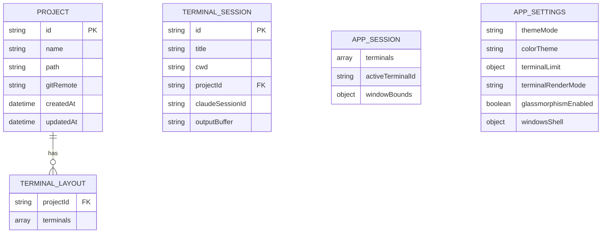

# Database Design (electron-store)

> Auto-generated from codebase via `/ipa:init`
> MultiClaude uses electron-store (JSON file-based) instead of SQL database

## 1. Overview

MultiClaude persists data using `electron-store`, which stores JSON files on disk:
- **Windows**: `%APPDATA%/multiclaude/`
- **macOS**: `~/Library/Application Support/multiclaude/`
- **Linux**: `~/.config/multiclaude/`

## 2. Store Files

| Store File | Class | Purpose |
|------------|-------|---------|
| `multiclaude-data.json` | `ProjectStore` | Projects, sessions, terminal layouts |
| `multiclaude-settings.json` | `SettingsStore` | App preferences |
| `multiclaude-notifications.json` | (inline) | Notification config |

## 3. Entity-Relationship Diagram



## 4. Schema Definitions

### ProjectStore Schema (`multiclaude-data.json`)

```typescript
interface ProjectStoreSchema {
  projects: Project[]
  activeProjectId: string | null
  session: AppSession | null
  terminalLayouts: Record<string, ProjectTerminalLayout>
}
```

#### E-01: Project

| Field | Type | Required | Description |
|-------|------|----------|-------------|
| `id` | string | ✅ | Unique ID (format: `proj-{timestamp}-{random}`) |
| `name` | string | ✅ | Display name (folder name) |
| `path` | string | ✅ | Absolute filesystem path |
| `gitRemote` | string | ❌ | Git remote URL |
| `createdAt` | Date | ✅ | Creation timestamp |
| `updatedAt` | Date | ✅ | Last update timestamp |

#### E-02: ProjectTerminalLayout

| Field | Type | Required | Description |
|-------|------|----------|-------------|
| `projectId` | string | ✅ | Reference to Project.id |
| `terminals` | ProjectTerminal[] | ✅ | Legacy flat list (kept for backward compat / downgrade safety) |
| `paneTree` | PaneTree \| null | ❌ | Binary split tree layout (schemaVersion 2+) |
| `schemaVersion` | number | ❌ | Layout schema version; absent/1 = legacy flat, 2 = pane tree |

Migration: on first `loadPaneTree(projectId)` call after upgrade, legacy layouts (no `paneTree`, `schemaVersion < 2`) are converted via `migrateFlatToTree(ids, isPortrait)` preserving the pre-upgrade visual arrangement for N=1–12 terminals. Migration is idempotent and does not delete `terminals[]`.

#### E-03: ProjectTerminal

| Field | Type | Required | Description |
|-------|------|----------|-------------|
| `id` | string | ✅ | Terminal instance ID |
| `title` | string | ✅ | Tab title |
| `position` | number | ✅ | Legacy grid position (pre-paneTree); ignored when `paneTree` present |

#### E-02a: PaneTree

Binary split tree (tmux/iTerm-style). Discriminated union:

```ts
type PaneTree = PaneLeaf | PaneSplit

interface PaneLeaf {
  kind: 'leaf'
  terminalId: string  // references ProjectTerminal.id
}

interface PaneSplit {
  kind: 'split'
  orientation: 'row' | 'column'  // row = side-by-side, column = stacked
  ratio: number                   // children[0] size fraction, clamped [0.1, 0.9]
  children: [PaneTree, PaneTree]
}
```

Invariants enforced at the store boundary (`savePaneTree` validation):
- Split always has exactly 2 children
- `ratio ∈ [0.1, 0.9]`
- Leaf `terminalId` non-empty string
- All terminalIds across leaves are unique within a tree

#### E-04: AppSession

| Field | Type | Required | Description |
|-------|------|----------|-------------|
| `terminals` | TerminalSession[] | ✅ | Active terminal sessions |
| `activeTerminalId` | string | ❌ | Currently focused terminal |
| `windowBounds` | object | ❌ | Window position/size |

#### E-05: TerminalSession

| Field | Type | Required | Description |
|-------|------|----------|-------------|
| `id` | string | ✅ | Terminal instance ID |
| `title` | string | ✅ | Tab title |
| `cwd` | string | ✅ | Working directory |
| `projectId` | string | ❌ | Associated project |
| `claudeSessionId` | string | ❌ | Claude session ID |
| `outputBuffer` | string | ✅ | Scrollback buffer |

### SettingsStore Schema (`multiclaude-settings.json`)

```typescript
interface SettingsStoreSchema {
  settings: AppSettings
}
```

#### E-06: AppSettings

| Field | Type | Default | Description |
|-------|------|---------|-------------|
| `themeMode` | `'light' \| 'dark' \| 'system'` | `'system'` | Color mode preference |
| `colorTheme` | ColorTheme | `'tokyo-night'` | Color theme selection |
| `terminalLimit` | TerminalLimit | `{ preset: 9 }` | Max terminals per project |
| `terminalRenderMode` | `'performance' \| 'balanced' \| 'quality'` | `'balanced'` | WebGL rendering mode |
| `glassmorphismEnabled` | boolean | `true` | Glass effect toggle |
| `windowsShell` | WindowsShell | undefined | Default shell (Windows) |
| `enableContextWindow` | boolean | `true` | Context analyzer enabled (startup-only) |

#### E-07: TerminalLimit

| Field | Type | Description |
|-------|------|-------------|
| `preset` | `2 \| 4 \| 9 \| 'custom'` | Preset value or custom |
| `customValue` | number | Custom limit (1-99) |

#### E-08: WindowsShell

| Type | Fields | Description |
|------|--------|-------------|
| `{ type: 'cmd' }` | - | Windows Command Prompt |
| `{ type: 'powershell' }` | - | PowerShell |
| `{ type: 'wsl', distro: string }` | distro name | WSL distribution |

### ColorTheme Values (Unified VibeTerminal Themes)

VibeTerminal uses 5 curated themes (each includes UI colors + full ANSI 16-color palette for xterm):

| ID | Name | Background |
|----|------|------------|
| `tokyo-night` | Tokyo Night | #1a1b26 |
| `catppuccin` | Catppuccin Mocha | #1e1e2e |
| `dracula` | Dracula | #282a36 |
| `rose-pine` | Rosé Pine | #191724 |
| `pro-dark` | Pro Dark | #0d1117 |

## 5. Data Operations

### ProjectStore Methods

| Method | Parameters | Returns | Description |
|--------|------------|---------|-------------|
| `getProjects()` | - | `Project[]` | List all projects |
| `getProject(id)` | `id: string` | `Project \| undefined` | Get single project |
| `addProject(project)` | `Omit<Project, 'id' \| 'createdAt' \| 'updatedAt'>` | `Project` | Create project |
| `updateProject(id, updates)` | `id, Partial<Project>` | `Project \| null` | Update project |
| `deleteProject(id)` | `id: string` | `boolean` | Delete project |
| `getActiveProjectId()` | - | `string \| null` | Get active project |
| `setActiveProjectId(id)` | `id: string \| null` | void | Set active project |
| `saveSession(session)` | `AppSession` | void | Save session state |
| `getSession()` | - | `AppSession \| null` | Restore session |
| `clearSession()` | - | void | Clear session |
| `saveTerminalLayout(...)` | `projectId, layout` | void | Save terminal layout |
| `loadTerminalLayout(...)` | `projectId` | `ProjectTerminalLayout \| null` | Load terminal layout |
| `deleteTerminalLayout(...)` | `projectId` | void | Delete terminal layout |
| `savePaneTree(...)` | `projectId, tree` | void | Persist pane tree (validates shape) |
| `loadPaneTree(...)` | `projectId` | `PaneTree \| null` | Load pane tree with on-read legacy migration |

### SettingsStore Methods

| Method | Parameters | Returns | Description |
|--------|------------|---------|-------------|
| `getSettings()` | - | `AppSettings` | Get all settings |
| `setSettings(settings)` | `Partial<AppSettings>` | `AppSettings` | Update settings |
| `resetSettings()` | - | `AppSettings` | Reset to defaults |

## 6. Data Validation

Settings validation is performed before saving:

```typescript
// Enum validation
const VALID_THEME_MODES = ['light', 'dark', 'system']
const VALID_COLOR_THEMES = ['default', 'dusk', 'lime', ...]
const VALID_RENDER_MODES = ['performance', 'balanced', 'quality']
const VALID_TERMINAL_PRESETS = [2, 4, 9, 'custom']

// Custom terminal limit: 1-99 range
if (limit.preset === 'custom') {
  customValue >= 1 && customValue <= 99
}
```

## 7. Security

| Concern | Implementation |
|---------|----------------|
| Credential Storage | Telegram/Discord tokens use `electron.safeStorage` |
| File Location | OS-standard app data directory |
| Sensitive Data | API tokens NOT stored in JSON stores |

## 8. Source Files

| File | Purpose |
|------|---------|
| `src/main/project/project-store.ts` | ProjectStore class |
| `src/main/settings/settings-store.ts` | SettingsStore class |
| `src/shared/types/index.ts` | Type definitions |
| `src/shared/constants/index.ts` | Default values |
