```mermaid
---
title: React Reconciliation Bug - Terminal Remounting on Project Switch
---
graph TB
    subgraph "CURRENT IMPLEMENTATION (BROKEN)"
        A[TerminalGrid Component] --> B[Hidden Container: display none]
        A --> C[Visible Container: Panel Grid]

        B --> B1[Terminal A key=term-a]
        B --> B2[Terminal B key=term-b]

        C --> C1[Terminal C key=term-c]
        C --> C2[Terminal D key=term-d]

        style B fill:#ff6b6b
        style C fill:#51cf66
        style B1 fill:#ff8787
        style C1 fill:#69db7c
    end

    subgraph "WHAT HAPPENS ON PROJECT SWITCH"
        D[Project A → Project B] --> E{React Reconciliation}
        E --> F[Terminal C: Was in Panel Grid]
        E --> G[Terminal C: Now needs Hidden Container]

        F --> H[Different Parent Detected!]
        G --> H
        H --> I[UNMOUNT from Panel Grid]
        I --> J[Destroy XTerm instance]
        J --> K[Lose cursor position, buffer state]
        K --> L[MOUNT in Hidden Container]
        L --> M[Create NEW XTerm instance]
        M --> N[Restore from initialOutput string]
        N --> O[Cursor position WRONG]

        style H fill:#ff6b6b
        style J fill:#ff6b6b
        style O fill:#ff6b6b
    end

    subgraph "CORRECT FIX (Single Parent)"
        P[TerminalGrid Component] --> Q[Single Container - ALL Terminals]

        Q --> Q1[Terminal A: display block]
        Q --> Q2[Terminal B: display block]
        Q --> Q3[Terminal C: display none]
        Q --> Q4[Terminal D: display none]

        R[Project Switch] --> S{React Reconciliation}
        S --> T[Same Parent - Same Key]
        T --> U[NO unmount - Just CSS change]
        U --> V[XTerm instance preserved]
        V --> W[Cursor position preserved ✓]

        style Q fill:#51cf66
        style W fill:#51cf66
    end

    subgraph "React Key Rules"
        X[Key Matching] --> Y[Only within SAME parent]
        Y --> Z[Different parent = Different tree position]
        Z --> AA[Different tree position = Unmount + Remount]

        style AA fill:#ffd43b
    end
```

---

## Visual Summary

**Problem**: Two different parent containers
- Hidden terminals in `
`
- Visible terminals in `<Panel>` grid
- When terminal moves between containers → React unmounts/remounts

**Solution**: One parent container for all
- Control visibility with CSS on child wrappers
- React sees same parent → preserves component instance
- XTerm.js stays mounted → cursor position preserved
